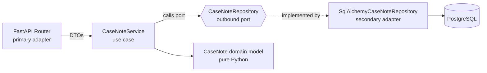

[](https://codespaces.new/collisdigital/python-castnote-example)

# NHS Case Notes Tracking API — Hexagonal Architecture Demo

A reference **Case Notes Tracking** feature slice showing how to implement
**Hexagonal Architecture (Ports & Adapters)** inside a single Python package
using modern 2026 patterns: **Python 3.14+**, **FastAPI (async)**,
**Pydantic v2**, **SQLAlchemy 2.0 + asyncpg**, and **`uv`** for dependency
management.

> Case Notes are the physical paper folders of patient information used in NHS
> hospitals. This demo CRUD API tracks where each folder is, and lets you move
> it (e.g. from *Medical Records Library* to *Ward 4*).

## Quick Start

```bash
just infra      # 1. Start local Postgres (docker compose)
just install    # 2. Install deps into a uv-managed virtualenv
just dev        # 3. Run the API with hot-reload at http://localhost:8000/docs
```

No `just`? The raw equivalents:

```bash
docker compose up -d
uv sync --extra dev
uv run uvicorn app.main:app --reload --host 0.0.0.0 --port 8000
```

Then open the interactive Swagger docs at **http://localhost:8000/docs**.

## Testing

```bash
just test        # or: uv run pytest -q
```

Tests run fully in-memory (SQLite + dependency overrides) — no Postgres needed.

## Architecture

The hexagon keeps NHS business rules at the centre, isolated from frameworks.
Dependencies always point **inwards** toward the pure domain core.



### Layout

```
app/
  main.py                         # Composition root: wires adapters, maps errors
  config.py                       # pydantic-settings configuration
  db.py                           # SQLAlchemy async engine / session plumbing
  case_notes/
    domain/                       # PURE core — no SQLAlchemy, no Pydantic
      models.py                   #   CaseNote + create_case_note() factory
      ports.py                    #   CaseNoteRepository (abc.ABC outbound port)
      exceptions.py               #   Framework-agnostic domain errors
    use_cases/                    # Application layer
      dtos.py                     #   Pydantic v2 request/response DTOs
      services.py                 #   CaseNoteService orchestration
    adapters/
      primary/                    # Inbound (driving) adapter
        router.py                 #   FastAPI APIRouter (async handlers)
        dependencies.py           #   Depends() IoC wiring
      secondary/                  # Outbound (driven) adapter
        orm.py                    #   SQLAlchemy 2.0 Mapped/mapped_column model
        repository.py             #   SqlAlchemyCaseNoteRepository (implements port)
tests/                            # Unit (domain/use-case) + HTTP integration tests
```

### Why the domain core stays pure

The `app/case_notes/domain/` package imports **no** SQLAlchemy and **no**
Pydantic. Those are infrastructure concerns:

- **Pydantic** validates/serialises data at the HTTP edge → it lives in
  `use_cases/dtos.py`, not the domain.
- **SQLAlchemy** maps objects to Postgres rows → it lives in
  `adapters/secondary/`, behind the `CaseNoteRepository` port.

This preserves the Hexagonal principle: business rules depend only on
abstractions, so adapters (Postgres ↔ in-memory, HTTP ↔ CLI) are swappable
without touching the core. The unit tests prove it by running the exact same
`CaseNoteService` against an in-memory fake repository.

### How `Depends` provides Inversion of Control

`adapters/primary/dependencies.py` builds the per-request object graph:

```
Request → AsyncSession → SqlAlchemyCaseNoteRepository → CaseNoteService
```

Route handlers only declare `service: ServiceDep` and FastAPI resolves and
injects a fully-constructed `CaseNoteService`. Handlers never `new` up a
repository or session, so swapping the concrete adapter is a one-line
`app.dependency_overrides[...]` change — exactly what the integration tests do
to substitute SQLite for Postgres.

## API

| Method   | Path                            | Description                          |
| -------- | ------------------------------- | ------------------------------------ |
| `POST`   | `/case-notes`                   | Create a tracking record             |
| `GET`    | `/case-notes`                   | List all tracking records            |
| `GET`    | `/case-notes/{tracking_id}`     | Fetch one tracking record            |
| `PATCH`  | `/case-notes/{id}/location`     | Move a case note to a new location   |
| `DELETE` | `/case-notes/{tracking_id}`     | Delete a tracking record             |

## Tooling

| Command          | Purpose                                          |
| ---------------- | ------------------------------------------------ |
| `just infra`     | Start local Postgres via docker compose          |
| `just dev`       | Run uvicorn with hot-reload (binds `0.0.0.0`)    |
| `just test`      | Run the pytest suite                             |
| `just lint`      | Ruff lint + format check                         |
| `just fmt`       | Auto-fix lint + format                           |

## Production image

A multi-stage `Dockerfile` builds dependencies with `uv`, then ships a slim,
non-root runtime image with no dev tooling:

```bash
docker build -t castnote-api .
docker run --rm -p 8000:8000 castnote-api
```

## License

MIT — see [LICENSE](LICENSE).